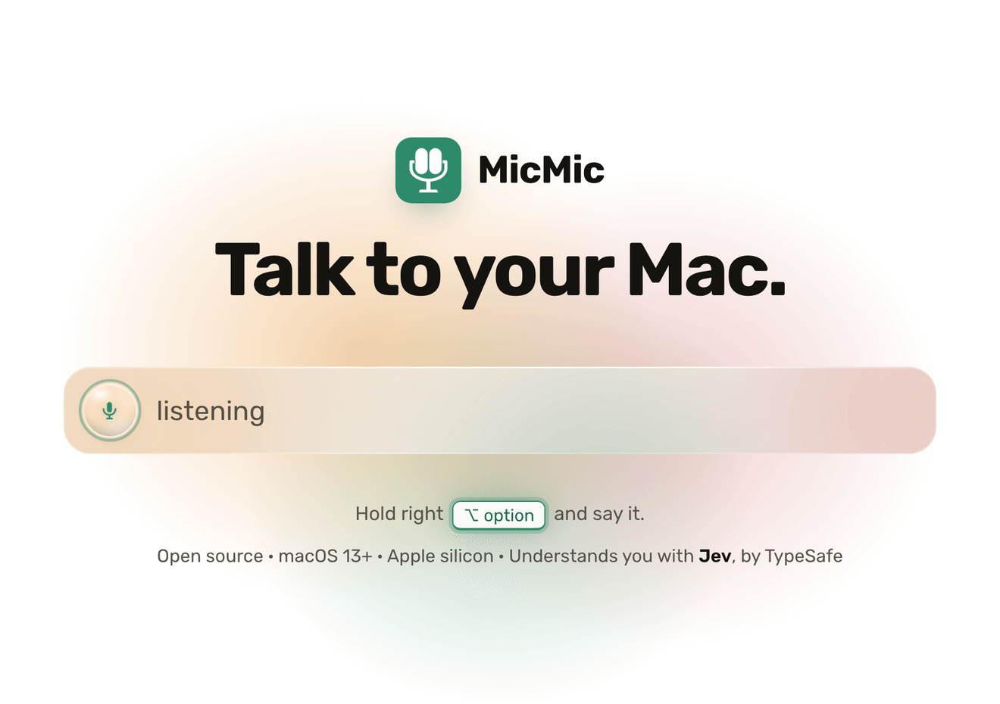
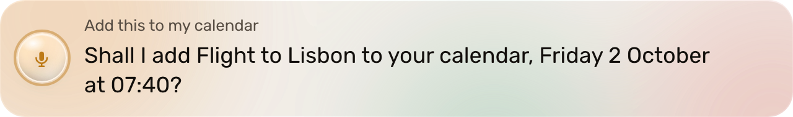
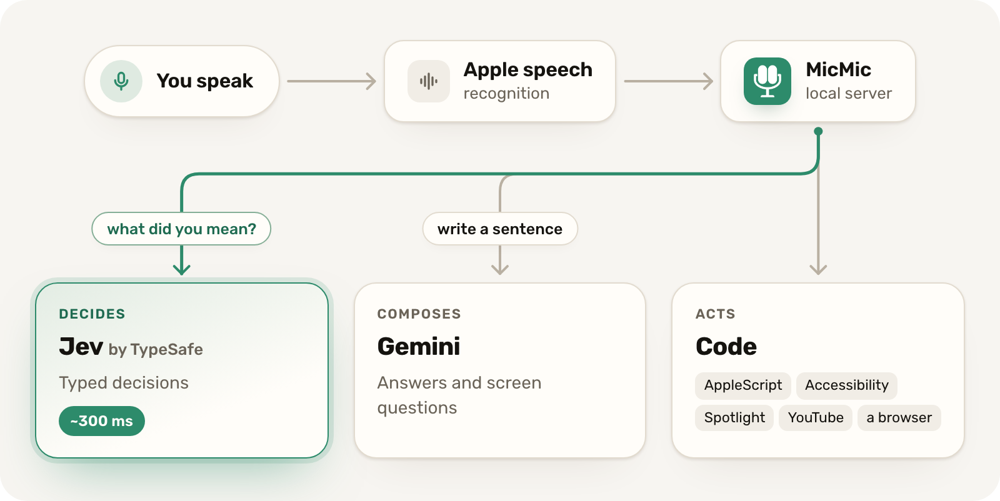

<div align="center">

<picture>
    <source media="(prefers-color-scheme: dark)" srcset="docs/assets/hero-dark.gif">
    <source media="(prefers-color-scheme: light)" srcset="docs/assets/hero-light.gif">
    
</picture>

### Talk to your Mac. It does the thing.

<sub>Understands you with <a href="https://typesafe.ai"><b>Jev</b></a>, by TypeSafe</sub>

MicMic is a voice assistant for macOS that acts instead of searching. Hold a key, say
what you want, let go. It plays it, sends it, opens it or reads your screen, and when it
can be put back, Undo is one click away.

<p>
  <a href="https://github.com/mosserii/micmic/releases/latest"></a>
</p>

<p>
  <a href="#requirements"></a>
  <a href="#requirements"></a>
  <a href="https://github.com/mosserii/micmic/releases/latest"></a>
  <a href="LICENSE"></a>
  <a href="https://github.com/mosserii/micmic/actions/workflows/tests.yml"></a>
</p>

<a href="#what-you-can-say">What you can say</a> &nbsp;&middot;&nbsp;
<a href="#how-it-works">How it works</a> &nbsp;&middot;&nbsp;
<a href="#privacy-in-plain-words">Privacy</a> &nbsp;&middot;&nbsp;
<a href="#build-from-source">Build from source</a> &nbsp;&middot;&nbsp;
<a href="CONTRIBUTING.md">Contributing</a>

</div>

<br>

## What you can say

Say it the way you would say it to a person. "This" means whatever is in front of you.
Replies in quotes are MicMic's own words.

| You say | MicMic |
|---|---|
| **What's on my screen?** | Reads the window in front of you and tells you what it is, in a sentence or two. |
| **Summarize this** | The email, page or document you are looking at, cut down to what matters. |
| **Send this to Matan** | "Sending Matan what you selected. Say no and I will stop." Then it goes, on WhatsApp or Messages. |
| **Add this to my calendar** | Finds the date on your screen and asks first: "Shall I add Flight to Lisbon to your calendar, Friday 2 October at 07:40?" |
| **Play this week's top 100 hits** | Finds it on YouTube and plays it. "Here you go. Top 100 Songs This Week." Undo closes it. |
| **No, something else** | The next best one, never the same one twice. |
| **Remind me in ten minutes to call Mom** | "I will remind you in 10 minutes." It speaks up when the time comes. |
| **Open WhatsApp** | Any app on your Mac, by its name. |
| **Find the contract I signed** | Searches your files with Spotlight and opens the one you meant, even across languages. |
| **In the calculator, press five** | Presses real buttons in other apps through Accessibility, the way VoiceOver reads them. |
| **What's the weather in Lisbon?** | That town, spoken back in your language. The time and the weather never touch a language model. |
| **Find me a flight from Tel Aviv to Lisbon next Friday** | Drives a real browser to Google Flights, fills in the trip and the date, and leaves the results on your screen. It never pays for anything. |
| **Send Dana a WhatsApp that I'm running late, then play some jazz** | Both, in order. |

<details>
<summary><b>What it will not do</b></summary>
<br>

- Send anything without telling you first and giving you a moment to say "no".
- Delete anything. There is no delete path in the code, and a test enforces that.
- Type a password, a card number or an identity number, or press the final button of a
  purchase. These are refused in plain Python before any model is asked.
- Place a phone call unless calling is switched on.

</details>

### Not only English

MicMic also understands Hebrew, Arabic and Russian, and answers in the language you
spoke. It tells them apart by the alphabet you spoke in, not by a guessing model.

## How it works

**1. Hold right Option** in any app. A slim bar opens at the top of your screen, like
Spotlight, and never takes focus from what you are doing.<br>
**2. Talk.** Your words show up in the bar as you speak.<br>
**3. Let go.** MicMic does it and shows you what it did.

<p align="center">
  <picture>
    <source media="(prefers-color-scheme: dark)" srcset="docs/assets/bar-listening-dark.png">
    
  </picture>
  <br><sub>Listening. Your words appear as you speak.</sub>
</p>

<p align="center">
  <picture>
    <source media="(prefers-color-scheme: dark)" srcset="docs/assets/bar-thinking-dark.png">
    
  </picture>
  <br><sub>Working on it.</sub>
</p>

<p align="center">
  <picture>
    <source media="(prefers-color-scheme: dark)" srcset="docs/assets/bar-result-dark.png">
    
  </picture>
  <br><sub>Done, or asking first when it matters.</sub>
</p>

Under the bar, two models do two different jobs, and neither ever touches your Mac:

<p align="center"><picture><source media="(prefers-color-scheme: dark)" srcset="docs/assets/how-it-works-dark.png"></picture></p>

- **Jev decides.** MicMic understands you with [Jev](https://typesafe.ai), the
  typed-decision model by TypeSafe. Jev cannot write free text, so code lists what
  really exists (your contacts, your apps, live search results) and Jev points at one.
  Nothing can be invented.
- **Gemini composes**, only where a sentence has to be written: answering a question,
  describing your screen, splitting "do this, then that".
- **Code acts.** Every side effect is plain Python you can read.

The downloaded app reaches Jev and Gemini through the MicMic cloud ([`proxy/`](proxy/)),
which holds the keys and counts requests per device. Build it yourself with your own
keys and it talks to them directly. The full map is in
[docs/ARCHITECTURE.md](docs/ARCHITECTURE.md).

## Privacy in plain words

**Sent to answer you:** the words you said, as text. Only when you ask about your
screen, the text on it, and sometimes a picture of the window in front.

**Kept:** a count of how many requests each device made. No recordings, no
transcripts, no screenshots. No ads, no selling of data.

**On your Mac:** your voice is turned into text by macOS. What MicMic learns about
you, like your name and who you talk to, stays in a folder on your Mac. Contacts are
shortlisted to a few dozen before any of them leave it. Every connection to your
message databases is read-only.

**Your own keys:** set them and nothing goes through our server at all. The privacy policy the
website serves, [`proxy/web/privacy.html`](proxy/web/privacy.html), names everyone who handles a
request.

## Download

**[Download MicMic for Mac](https://github.com/mosserii/micmic/releases/latest)**,
open it, and hold right Option. The first run walks you through the macOS permissions
it needs: Microphone, Speech Recognition and Accessibility, plus Screen Recording if
you want to ask about your screen.

Try it free, with no account and no card. MicMic Pro, $8 a month, raises the limit to
2,000 requests a day and is bought from inside the app.

### Requirements

- macOS 13 Ventura or later
- Apple silicon (M1 or later)
- An internet connection

## Build from source

You need [uv](https://docs.astral.sh/uv/) and the Xcode command line tools
(`xcode-select --install`).

```bash
git clone https://github.com/mosserii/micmic.git
cd micmic
uv sync                   # the assistant's environment
native/build.sh           # builds native/MicMic.app
open native/MicMic.app
```

Without a key, a source build registers with the MicMic cloud like the download does.
To use your own keys instead, put them in `.env.local` at the repo root:

```bash
TYPESAFE_API_KEY=...      # required: Jev, from TypeSafe
GEMINI_API_KEY=...        # optional: answers, screen questions, compound requests
```

Everything else works without Gemini. More on the app, permissions, logs and the
hotkey in [native/README.md](native/README.md); the cloud is documented in
[proxy/README.md](proxy/README.md).

### Run the tests

```bash
uv run python tests/test_micmic.py        # the regression suite (real Jev, stubbed Mac)
uv run python tests/test_screen.py        # screen reading, pure logic
uv run python tests/test_account.py       # the cloud client, against a fake cloud
cd proxy && uv sync && uv run python -m pytest -q
```

The main suite refuses to run with sending switched on, stubs every AppleScript call,
and reports how many escaped the stub. That number must be zero.

## Project layout

| Path | What it holds |
|---|---|
| [`native/`](native/) | the Mac app: hotkey, microphone, speech, the bar, the window, the build |
| [`savta/router.py`](savta/router.py) | all policy: thresholds, read-back, undo, what happens when |
| [`savta/brain.py`](savta/brain.py) | every question MicMic asks Jev, and the pick-one-row patterns |
| [`savta/actions/`](savta/actions/) | the side effects: Mac, apps, screen, contacts, YouTube, web |
| [`savta/web/`](savta/web/) | the one UI, used by the bar and the window |
| [`proxy/`](proxy/) | the MicMic cloud and website: device tokens, metering, Stripe |
| [`tests/`](tests/) | the suites, the adversarial tests, and the latency bench |
| [`brand/`](brand/), [`site/`](site/) | the icon, and the scripts that render the art on this page |

`savta` is the project's original codename: it started as a Mac a grandmother could use
by talking to it. She is still the acceptance test.

## Contributing

Issues and pull requests are welcome. Start with [CONTRIBUTING.md](CONTRIBUTING.md):
dev setup, the test suites, and the few rules that do not bend (nothing is sent
without a read-back, there is no delete path, every candidate is real). Questions and
ideas go to [Discussions](https://github.com/mosserii/micmic/discussions). Security
issues go to [SECURITY.md](SECURITY.md), not to a public issue.

## License

[MIT](LICENSE), copyright 2026 BetterFly AI LTD. The MicMic name and icon identify this
project; please give a fork its own ([TRADEMARKS.md](TRADEMARKS.md)). Bundled open-source
components are listed in [THIRD_PARTY_NOTICES.md](THIRD_PARTY_NOTICES.md).

## Acknowledgements

- [Jev](https://typesafe.ai) by TypeSafe, which makes a model that cannot write text
  into the fastest part of the assistant.
- [Gemini](https://ai.google.dev) for the sentences.
- [PyObjC](https://github.com/ronaldoussoren/pyobjc), which lets a Python app be a real
  Mac app.
- [Playwright](https://playwright.dev), which drives the browser agent.
- [Rubik](https://fonts.google.com/specimen/Rubik) by Hubert and Fischer, drawn for Hebrew
  and Latin together, under the SIL Open Font License.
- [uv](https://docs.astral.sh/uv/) for the environments and the relocatable Python in
  the release build.

<p align="center">
  <a href="https://star-history.com/#mosserii/micmic&Date">
    <picture>
      <source media="(prefers-color-scheme: dark)" srcset="https://api.star-history.com/svg?repos=mosserii/micmic&type=Date&theme=dark">
      
    </picture>
  </a>
</p>

<sub>Jev is a trademark of TypeSafe AI. MicMic is an independent project, not affiliated
with or endorsed by TypeSafe. Made by BetterFly AI LTD.</sub>
