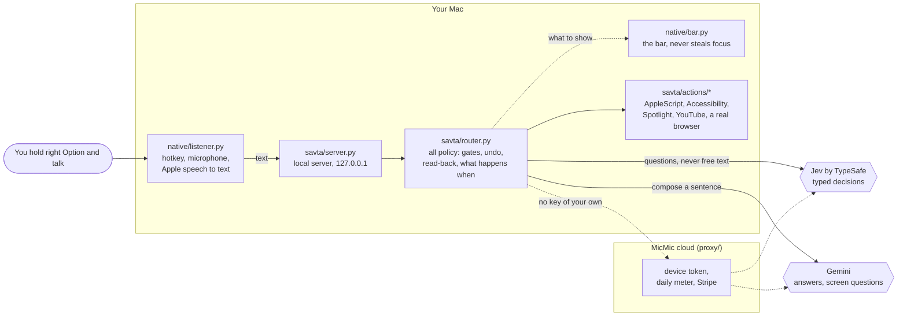

# How MicMic works

MicMic turns one spoken sentence into one real action on a Mac, usually within a second or two.
This page is the map: what runs where, and the handful of decisions that make it
work. The code is the detail; every file named here has a header that says why it
exists.

## The pieces

- **`native/`** is the app: a menu-bar process with a global hotkey, the microphone and
  Apple's speech recognizer. It knows nothing about the assistant. It POSTs text to the
  local server and shows what comes back. The bar and the window are the same web page,
  `savta/web/index.html`, hosted in a WKWebView, so there is one UI in four languages.
- **`savta/`** is the assistant, a plain Python server on `127.0.0.1`. The router owns
  every decision; the actions own every side effect.
- **`proxy/`** is the MicMic cloud. A downloaded MicMic has no API keys, so it registers
  an anonymous device token here, and the proxy forwards its Jev and Gemini calls and
  counts them per device: 100 free requests in total, then MicMic Pro's daily
  allowance. Only the official release knows the cloud's address; a build from source
  runs on your own keys and never contacts the proxy.

## Jev decides, Gemini composes, code acts

**Jev** is a typed-judgment model: it answers questions with calibrated probabilities
and cannot write free text. **Gemini** is a normal language model. MicMic gives each the
job it is good at:

- Jev owns the hot path: what you asked for, which contact, which video, whether the
  sentence is finished, whether it was even meant for MicMic. About 300 ms a call.
- Gemini only runs where a sentence has to be written: answering a question, splitting
  a compound request, describing your screen.
- Code owns every side effect. Neither model ever touches the Mac directly.

## Code proposes, the model points

A model that cannot write text cannot "extract" a name from a sentence. So code
enumerates what actually exists and Jev picks one row:

| request | what code enumerates |
|---|---|
| send a message | your real contacts, shortlisted by name shape |
| play something | live YouTube results |
| open an app | every `.app` on the Mac |
| find a file | Spotlight hits, filtered to things a person reads |
| fill a form field | every date in the next month, or every span of your own words |

Neither model can invent a contact, a file or an app, because the answer is always an
index into a list the code built.

## The rules the router enforces

- **One request, many questions.** A Jev call costs its round trip, not its questions,
  so the first call asks everything the decision tree might need (about 30 questions)
  at once.
- **Every choice has an escape hatch.** Probabilities over a list always sum to 1, so
  something always wins. Each choice is paired with a yes/no "is any of these right?"
  and that is the gate, not the winner's score.
- **Thresholds scale with blast radius.** Playing the wrong video is free to undo, so it
  acts on modest confidence. A message cannot be unsent, so it is always read back
  first, with a few seconds to say "no".
- **Narrate, then act.** MicMic says what it is about to do and does it, rather than
  asking a question and waiting.
- **Undo is real.** An action that can be put back registers its own undo; the Undo
  button in the bar calls it. Anything that cannot be undone never shows the button.
- **Hard refusals live in plain Python**, before any model pick can reach them: no
  password, card or identity fields, no final purchase button, and nothing that
  deletes, erases or resets. MicMic has no delete path of its own, and a test enforces
  that.

## Where the time goes

`tests/perf/` measures it. `bench.py` runs 27 turns across four languages through the
real router; `perf_check.py` replays them offline and counts round trips against the
ceilings in [`budget.json`](../tests/perf/budget.json), so a change cannot quietly add a
network hop. A recording is made on your own machine with your own key
(`bench.py` writes `tests/perf/replay.json`), because latency depends on where you are;
`perf_check.py` says so and exits 2 until one exists.

## State

Everything MicMic learns about you stays in its state directory on your Mac
(`~/Library/Application Support/MicMic` for the app, the repo root for a checkout, or
`MICMIC_STATE_DIR`): your profile, what you like, the device token. Every connection to
your message databases is opened read-only, and a test enforces that too.
